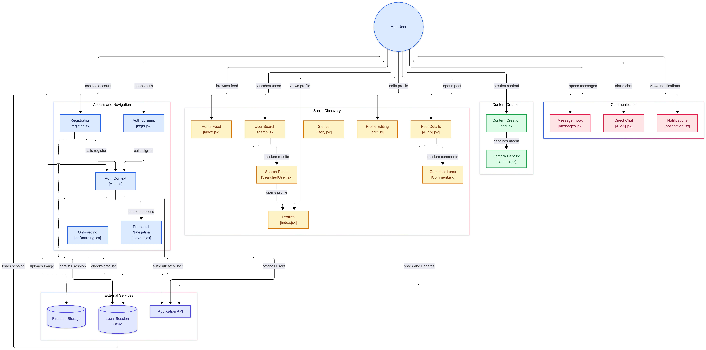

# Instalink — Mobile App (Frontend)

> A social media mobile app with feeds, stories, profiles, comments, camera capture, direct messaging and push notifications.

**[Salman Mohamed — Mobile Developer](https://salman-portfolio-roan.vercel.app/project/instalink)**

🔗 Backend repo: [`<link-to-instalink-backend-repo>`](https://github.com/salman7355/instaLinkBackend)

---

## Table of Contents

1. [Overview](#1-overview)
2. [Tech Stack](#2-tech-stack)
3. [Features](#3-features)
4. [The Process](#4-the-process-how-i-built-it)
5. [What I've Learned](#5-what-ive-learned)
6. [How It Can Be Improved](#6-how-it-can-be-improved)
7. [Running the Project](#7-running-the-project)
8. [Project Video](#8-project-video)

---

## 1. Overview

Instalink is a mobile social networking app where people can create an account, share photos, browse a feed, follow other users, comment on posts. This repository contains the **mobile client**. It talks to the Instalink REST API (see the backend repo) for data and uses Firebase Storage for image uploads.

The app is organised around five areas, shown in the architecture diagram below:

| Area | Responsibility |
| --- | --- |
| **Access & Navigation** | Registration, login, auth context, onboarding, protected routes |
| **Social Discovery** | Home feed, stories, user search, profiles, profile editing, post details and comments |
| **Content Creation** | Creating posts and capturing media with the camera |
| **Communication** | Message inbox, direct chat, notifications |
| **External Services** | Application API, Firebase Storage, local session store |

### Architecture




---

## 2. Tech Stack

- **React Native** with **file-based routing** (screens such as `[id].jsx` and `_layout.jsx`) — JavaScript / JSX
- **Context API** for authentication state (`Auth.js`)
- **Local session store** (on-device storage) to persist and reload the user session
- **Firebase Storage** for profile and post image uploads
- **REST API** (Express + PostgreSQL backend) for all application data
- **Expo Push Notifications** for delivering notifications to devices

---

## 3. Features

**Access & navigation**
- Account registration with profile image upload (to Firebase Storage)
- Login via the auth screens, authenticated against the API
- Global auth context that persists and reloads the session from local storage
- Protected navigation layout — app screens are only reachable once signed in
- First-use onboarding flow (checked against local storage)

**Social discovery**
- Home feed
- Stories
- User search with result list, opening a result takes you to that user's profile
- Profile pages and profile editing
- Post details screen with comments

**Content creation**
- Create new posts
- In-app camera capture for photos/media

**Communication**
- Posts comments
- Notifications screen

---

## 4. The Process (How I Built It)


1. **Planned the screens and flows** – mapped out the user journey (sign up → onboarding → feed → profile → chat) and grouped screens into the five areas above.
2. **Set up routing and authentication first** – built the auth context, session persistence and the protected layout so every other screen could rely on knowing who the user is.
3. **Built the social core** – feed, profiles, search, and post details with comments.
4. **Added content creation** – post creation and camera capture, with images uploaded to Firebase Storage.
5. **Added communication features** – inbox, direct chat and notifications, wired to the backend's push notification pipeline.
6. **Connected everything to the API** – replaced mock data with real endpoints from the backend repo.
7. **Documented the architecture** – generated the diagrams in this repo to keep the structure clear.

---

## 5. What I've Learned


- Designing a clear **auth flow** (context + persisted session + protected routes) early saves a lot of rework.
- Structuring screens by **feature area** keeps a growing app navigable.
- Handling **media** (camera, uploads) taught me about permissions, file sizes and upload error handling on mobile.
- Coordinating a **separate frontend and backend** requires clear API contracts and consistent data shapes.
- Push notifications involve both the client (permissions, tokens) and the server (sending, storing history).

---

## 6. How It Can Be Improved

- Real-time chat via WebSockets instead of request/response polling
- Pagination and infinite scroll for the feed, comments and search
- Offline support and caching (e.g. React Query)
- Moving to **TypeScript** for safer data models
- Image compression/resizing before upload
- Automated tests (unit and end-to-end) and CI
- Accessibility and localisation improvements
- Secure token storage and refresh-token handling

---

## 7. Running the Project

### Prerequisites
- Node.js (LTS)
- npm or yarn
- A running instance of the Instalink backend (see the backend repo)
- A Firebase project with Storage enabled
- Expo Go or an emulator/simulator

### Steps

```bash
# 1. Clone the repository
git clone <your-frontend-repo-url>
cd instalink-frontend

# 2. Install dependencies
npm install

# 3. Configure environment variables (see below)
cp .env.example .env

# 4. Start the app
npx expo start
```

Then press `i` (iOS simulator), `a` (Android emulator), or scan the QR code with Expo Go.

### Environment variables

> Adjust names to match your code.

```env
API_URL=http://<your-backend-host>:<port>
FIREBASE_API_KEY=
FIREBASE_AUTH_DOMAIN=
FIREBASE_PROJECT_ID=
FIREBASE_STORAGE_BUCKET=
FIREBASE_MESSAGING_SENDER_ID=
FIREBASE_APP_ID=
```


---


## Author

**Salman Mohamed** — Mobile Developer
🌐 [Portfolio](https://salman-portfolio-roan.vercel.app/project/instalink)
